# IOI Circuit Emergence During Training

Investigating when and how the Indirect Object Identification (IOI) circuit emerges during language model training.

**Author:** Tejas Dahiya, UW-Madison  
**Advisor:** Cole Blondin  
**Targets:** ICML 2026 Mech Interp Workshop / EMNLP 2026

## Summary

We track IOI circuit formation across 17 independent training runs spanning two model families (Pythia and Stanford GPT-2). Three core findings:

1. All 17 runs show a below-chance accuracy dip in early training. The dip is invariant to random seed, data ordering, and weight initialization (PolyPythias), and replicates across model families (Pythia vs Stanford GPT-2). It is an architectural property of how transformers learn IOI.

2. The head with the largest single-head ablation effect is consistently an S-inhibition head, not a name mover. It attends to the repeated subject token (S2) and suppresses it in the output logits. S-suppression contributes 2-10x more to the logit difference than IO-copying. This holds across both model families.

3. High-resolution checkpoints from Stanford GPT-2 (609 available) reveal that recovery from the dip is not a sharp phase transition but a prolonged, noisy process where the circuit forms and collapses repeatedly over thousands of steps.

## Table of Contents

- [Finding 1: The Dip Is Universal](#finding-1-the-dip-is-universal)
- [Finding 2: The Dip Is Not Seed or Data Dependent](#finding-2-the-dip-is-not-seed-or-data-dependent)
- [Finding 3: Names Are Not in Consideration During the Dip](#finding-3-names-are-not-in-consideration-during-the-dip)
- [Finding 4: Recovery Is Noisy, Not a Phase Transition](#finding-4-recovery-is-noisy-not-a-phase-transition)
- [Finding 5: Early Name Movers Are Mechanistically Empty](#finding-5-early-name-movers-are-mechanistically-empty)
- [Finding 6: The Dominant Head Is S-Inhibition, Not a Name Mover](#finding-6-the-dominant-head-is-s-inhibition-not-a-name-mover)
- [Finding 7: S-Suppression Replicates Across Model Families](#finding-7-s-suppression-replicates-across-model-families)
- [Finding 8: L8H9 Undergoes a Phase Transition at Step 3000](#finding-8-l8h9-undergoes-a-phase-transition-at-step-3000)
- [Finding 9: The Multi-Hop Pipeline](#finding-9-the-multi-hop-pipeline)
- [Finding 10: Ablation-Based Classification Is Unreliable](#finding-10-ablation-based-classification-is-unreliable)
- [Finding 11: Scale-Dependent Mechanisms](#finding-11-scale-dependent-mechanisms)
- [Additional Results](#additional-results)
- [Limitations](#limitations)
- [Dataset](#dataset)
- [Repo Structure](#repo-structure)
- [References](#references)

---

## Finding 1: The Dip Is Universal

All models tested show IOI accuracy dropping below chance (50%) during early training. This holds across two model families trained on different data with different code.

**Pythia family (3 scales, trained on The Pile):**

| Step | 160M | 410M | 1B |
|------|------|------|-----|
| 0 | 52% | 49% | 51% |
| 1000 | **41%** | **41%** | **38%** |
| 2000 | 35% | 42% | 67% |
| 3000 | 61% | 88% | 92% |
| 143000 | 100% | 100% | 100% |

**Stanford GPT-2 Small (2 seeds, trained on OpenWebText):**

| Step | Alias (seed 21) | Battlestar (seed 49) |
|------|----------------|---------------------|
| 500 | 43% | 42% |
| 1000 | **30%** | **25%** |
| 1500 | **10%** | -- |
| 2000 | 16% | **12%** |
| 5000 | 31% | 51% |
| 10000 | 59% | 68% |
| 50000 | 100% | 100% |

Stanford GPT-2 dips deeper (down to 10%) and recovers slower (step 10000 vs Pythia's step 3000). The dip is universal but its depth and duration vary.

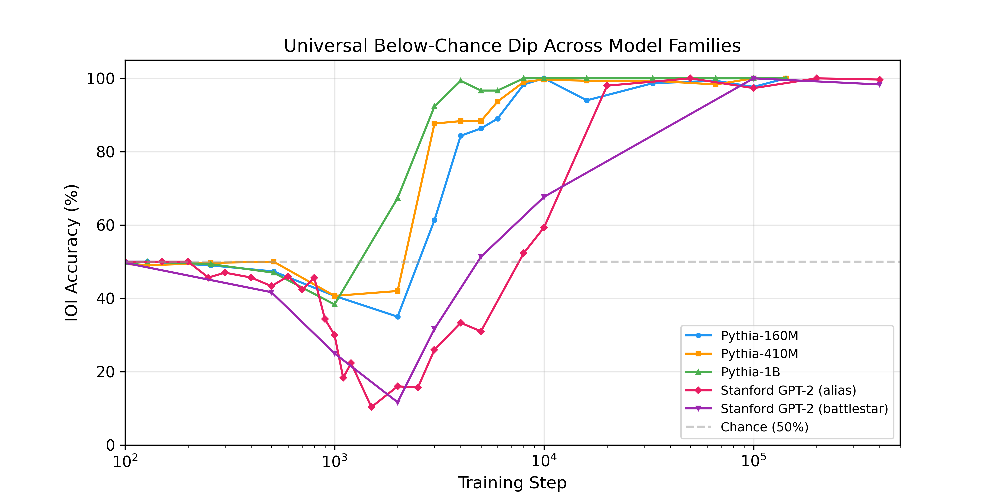

---

## Finding 2: The Dip Is Not Seed or Data Dependent

Using EleutherAI's PolyPythias release, we tested 9 Pythia-160M variants that isolate the effects of random seed, data ordering, and weight initialization. All 9 dip below chance.

| Step | seed1 | seed3 | seed5 | d-s1 | d-s2 | d-s3 | w-s1 | w-s2 | w-s3 |
|------|-------|-------|-------|------|------|------|------|------|------|
| 0 | 50% | 52% | 52% | 53% | 53% | 53% | 50% | 52% | 50% |
| 1000 | **38%** | **31%** | **42%** | **42%** | **36%** | **41%** | **43%** | **44%** | **39%** |
| 2000 | **32%** | **18%** | **34%** | **29%** | **28%** | **35%** | **33%** | **37%** | **31%** |
| 3000 | 80% | 73% | 61% | 70% | 59% | 83% | 65% | 72% | 73% |
| 143000 | 100% | 99% | 100% | 99% | 100% | 96% | 100% | 100% | 100% |

- **data-seed variants** (d-s1 through d-s3): same weight initialization, different data ordering. All dip. Data ordering does not cause the dip.
- **weight-seed variants** (w-s1 through w-s3): same data ordering, different weight initialization. All dip. Weight initialization does not cause the dip.
- **full-seed variants** (seed1 through seed5): both changed. All dip.

The dip is architectural.

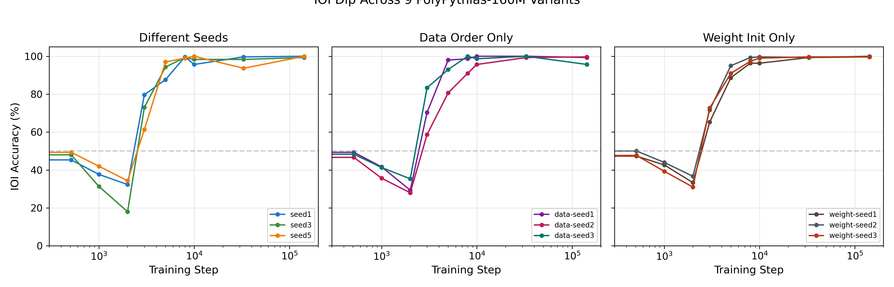

---

## Finding 3: Names Are Not in Consideration During the Dip

At step 1000, both IO and S names sit at rank 150-210 out of 50,257 tokens. The model predicts "the" 95% of the time. The "60% S-preference" is a 0.02 percentage point probability difference.

| Step | IO rank | IO prob | S rank | S prob | IO top-1 |
|------|---------|---------|--------|--------|----------|
| 1000 | 208 | 0.05% | 147 | 0.07% | 0.0% |
| 2000 | 13 | 1.13% | 7 | 1.91% | 0.3% |
| 3000 | 4 | 5.77% | 6 | 3.07% | 11.0% |
| 8000 | 1 | 19.4% | 8 | 1.62% | 47.3% |
| 143000 | 0 | 34.6% | 14 | 1.04% | 62.7% |

The model is not "choosing the wrong name" at step 1000. It has not learned that names belong in this position at all. Names enter the top-15 by step 2000. IO overtakes S at step 3000, precisely when L8H9 locks onto S2.

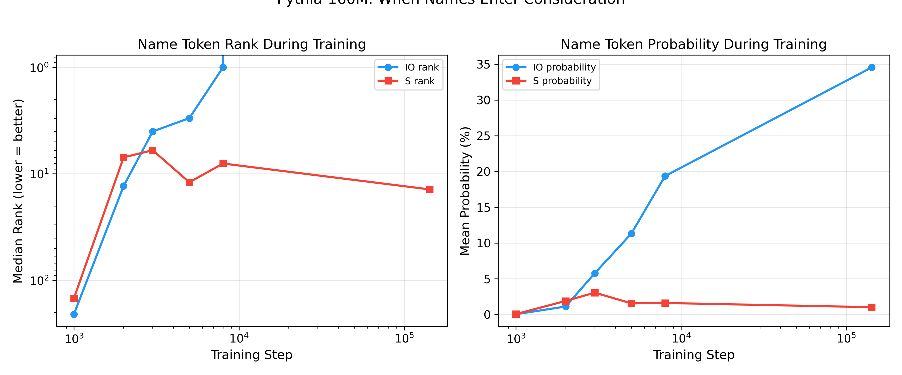

---

## Finding 4: Recovery Is Noisy, Not a Phase Transition

Stanford GPT-2's 609 checkpoints give a high-resolution view of the transition zone (61 data points between steps 500-5000). The recovery is not clean:

Phase 1 -- Gradual descent (steps 500-1450): accuracy drops from 43% to 9%, smooth and consistent.

Phase 2 -- Noisy bottom (steps 1350-2500): wild oscillations between 6-27%. The circuit forms and collapses repeatedly.

Phase 3 -- Noisy recovery (steps 2500-5000): hits 50% at step 4100, drops back to 24% at step 4300. Still below chance at step 5000.

We verified the oscillations are real (not sampling noise) by retesting volatile steps with n=600 examples:

| Step | n=300 | n=600 | SE |
|------|-------|-------|-----|
| 3700 | 43.0% | 40.8% | 2.0% |
| 3800 | 20.3% | 26.0% | 1.8% |
| 4100 | 50.0% | 50.0% | 2.0% |
| 4300 | 20.3% | 24.3% | 1.8% |

The circuit genuinely forms and collapses during recovery. This is developmental instability, not measurement noise.

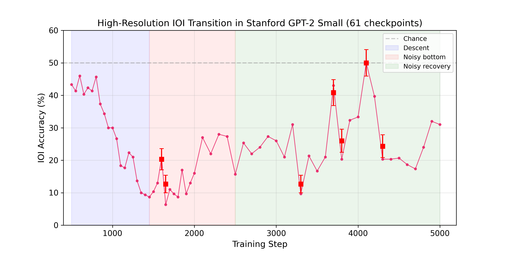
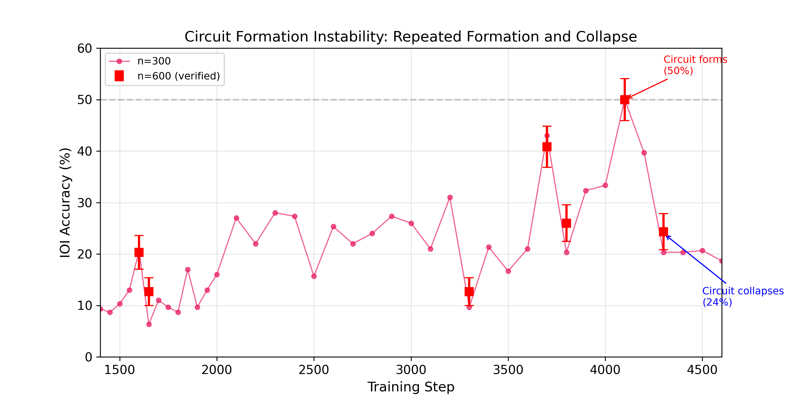

---

## Finding 5: Early Name Movers Are Mechanistically Empty

At step 1000, three heads in Pythia-160M (L0H5, L0H6, L0H10) pass the name-mover classification threshold. But they have uniform attention (~5-6% to every position) and their output projections onto IO/S directions are near zero (~0.001) at every training step.

These heads pass the ablation metric by accident of small perturbations. They are not doing name-moving.

---

## Finding 6: The Dominant Head Is S-Inhibition, Not a Name Mover

The head with the largest single-head ablation effect in Pythia-160M is L8H9. Under Wang et al.'s attention-based classification, L8H9 is an **S-inhibition head**, not a name mover:

- L8H9 attends 92.5% to S2 (not IO)
- L8H9 writes IO=-0.47, S=-6.22 into the residual stream
- Net effect: S-suppression of +5.74 logit difference

The actual name mover (IO-copier) is L8H1:

- L8H1 attends 72.4% to IO
- L8H1 writes IO=+1.23, S=+0.70
- Net effect: IO-copying of +0.53 logit difference

S-suppression (+5.74) contributes 10.8x more than IO-copying (+0.53).

There is also a negative name mover (L9H1) that attends 83.6% to IO but writes negative IO (-1.32). It attends to the right name but suppresses it.

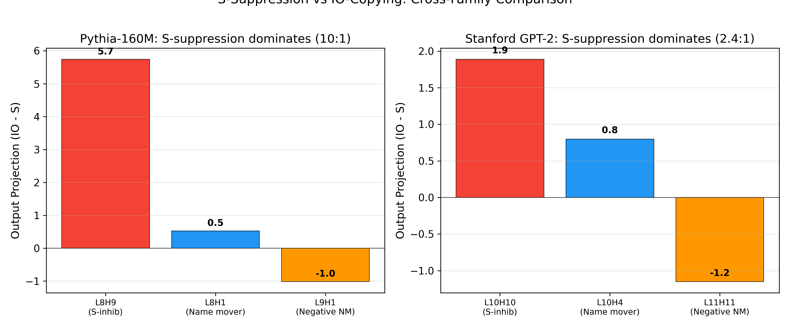

---

## Finding 7: S-Suppression Replicates Across Model Families

Stanford GPT-2's dominant head (L10H10) is also an S-inhibition head:

| Property | Pythia L8H9 | Stanford L10H10 |
|----------|-------------|----------------|
| Wang classification | S-inhibition | S-inhibition |
| Attention to S2 | 92.5% | 59.3% |
| S projection | -6.22 | -1.94 |
| IO-S projection diff | +5.74 | +1.89 |

Stanford's actual name mover is L10H4 (IO-copier, proj diff=+0.80). S-suppression to IO-copying ratio is 2.4:1 in Stanford vs 10.8:1 in Pythia.

Stanford also has a negative name mover (L11H11) that attends 64% to IO but writes negative IO (-1.39), matching Pythia's L9H1 pattern.

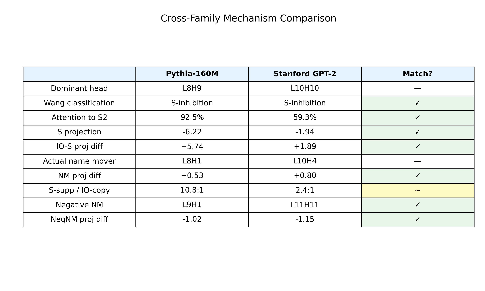

---

## Finding 8: L8H9 Undergoes a Phase Transition at Step 3000

Tracking L8H9's attention to S2 across 24 Pythia-160M checkpoints reveals a sharp transition:

| Step | L8H9 to S2 | Accuracy |
|------|-----------|----------|
| 1000 | 0.022 | 41% |
| 2000 | 0.009 | 36% |
| 3000 | **0.857** | 58% |
| 4000 | 0.712 | 81% |
| 143000 | 0.926 | 100% |

L8H9 attention to S2 jumps from 0.009 to 0.857 between steps 2000 and 3000. This is a genuine phase transition. The circuit snaps into place within a single checkpoint interval.

Meanwhile L1H8 (duplicate token) and L1H4 both drop to 0.000 at the final position by step 3000. They have specialized entirely to the S2-to-S1 circuit.

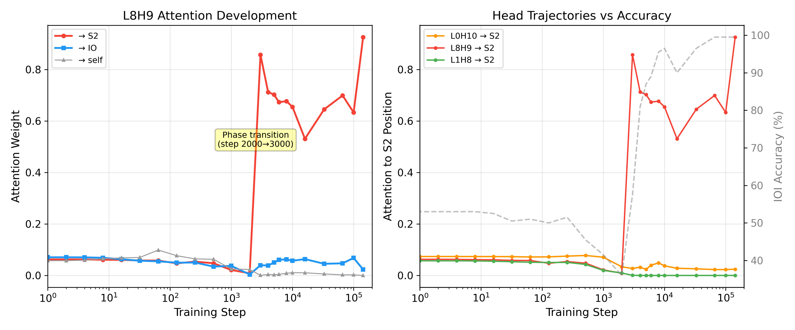

---

## Finding 9: The Multi-Hop Pipeline

The IOI circuit in Pythia-160M is a multi-hop pipeline:

1. **L1H8** (layer 1): attends 91.4% from S2 to S1 (duplicate token detection)
2. Other heads (L6H10=44.9%, L2H3=41.9%, L3H3=41.3%) add processing at S2
3. **L8H9** (layer 8): reads the processed S2 representation, writes -6.22 S-suppression
4. **L8H1** (layer 8): reads IO, writes +1.23 IO-copying
5. IO wins because S-suppression (+5.74) dominates IO-copying (+0.53)

L8H9 does not read "raw S." It reads a representation that L1H8 and other duplicate-token heads have enriched with repetition information.

---

## Finding 10: Ablation-Based Classification Is Unreliable

**Threshold sensitivity:** The number of heads classified as name movers depends dramatically on the tau threshold:

| Tau | Step 143000 NM | Step 143000 NegNM | % of all heads |
|-----|---------------|-------------------|----------------|
| 0.005 | 65 | 70 | 94% |
| 0.02 | 54 | 53 | 74% |
| 0.05 | 45 | 38 | 58% |
| 0.10 | 34 | 26 | 42% |
| 0.20 | 21 | 12 | 23% |

At tau=0.02, 74% of all 144 heads are classified as either name movers or negative name movers. This is clearly too loose.

**Wang et al. attention-based classification gives more reasonable counts:**

| Step | Name Movers | S-Inhibition | Duplicate Token | Previous Token |
|------|------------|-------------|----------------|---------------|
| 512 | 16 | 19 | 4 | 9 |
| 1000 | 19 | 14 | 5 | 12 |
| 3000 | 16 | 23 | 11 | 14 |
| 143000 | 25 | 13 | 8 | 18 |

Key finding: L8H9 is classified as S-inhibition (not name mover) under Wang et al.'s attention criteria at every step from 3000 onward. The standard practice of calling the highest-ablation-impact head a "name mover" is misleading.

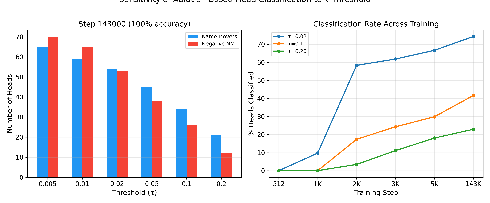
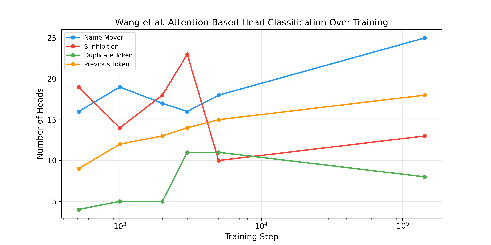

---

## Finding 11: Scale-Dependent Mechanisms

The dominant head's mechanism varies by model depth:

| Model | Head | Layer position | Attn to S2 | Proj diff | Mechanism |
|-------|------|---------------|-----------|-----------|-----------|
| 160M (12L) | L8H9 | 67% depth | 92.5% | +5.74 | Direct S-suppression |
| 410M (24L) | L4H6 | 17% depth | 0.7% | +0.002 | Indirect (via downstream layers) |
| 1B (16L) | L11H0 | 69% depth | 60.5% | -- | Partial S-suppression |
| Stanford GPT-2 (12L) | L10H10 | 83% depth | 59.3% | +1.89 | Direct S-suppression |

S-suppression appears in models where the dominant head is in the final third of the network (160M, 1B, Stanford GPT-2). Pythia-410M's L4H6 is at layer 4/24, too early for direct logit effects. Its near-zero projection (IO=-0.024, S=-0.026) confirms it works through indirect downstream effects rather than directly modifying the output distribution.

---

## Additional Results

**Pile vs synthetic:** Pile (natural) IOI accuracy stays near 50% during the synthetic dip. At step 1000, L8H9 barely fires on Pile text (S2 attention 0.8% vs synthetic 2.3%), explaining why the half-formed circuit does not interfere with natural text.

**Pile ablation across scales:** Ablating the dominant head at step 143000 drops Pile accuracy by 10.4pp (160M), 37.2pp (410M), and 4.2pp (1B). The 1B model is highly redundant while 410M is more dependent on its dominant head for Pile than for synthetic.

**Induction heads as control:** Induction head emergence is monotonic across all three Pythia scales. No dip, no reorganization. The non-monotonic pattern is specific to multi-head circuits like IOI.

**Prefix robustness:** Stripping 5 tokens before IO in Pile prompts drops accuracy from 65.6% to 50.3%. The prefix carries real signal.

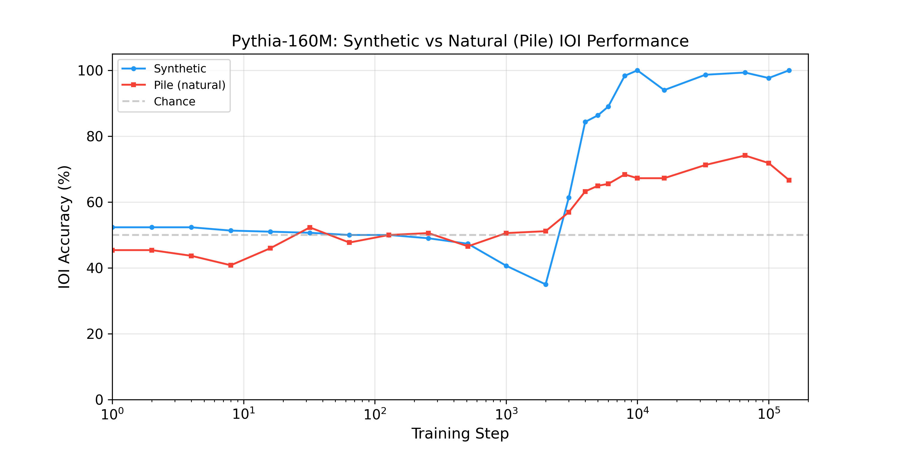
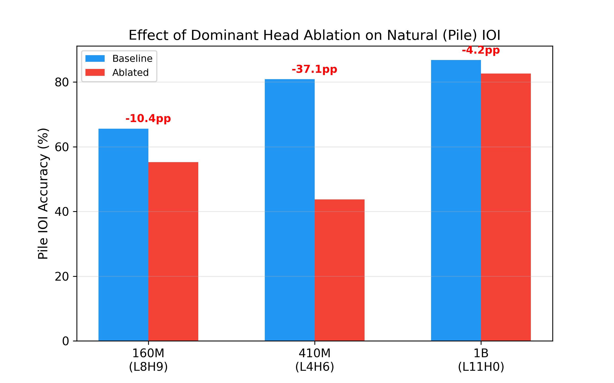

---

## Limitations

1. All models tested are 124M-1B parameters trained on English web text. We have not tested larger models, non-English models, or non-autoregressive architectures.

2. The S-suppression to IO-copying ratio varies across families (10:1 in Pythia, 2.4:1 in Stanford GPT-2). We do not know why.

3. Pythia-410M uses a fundamentally different mechanism than the other models. The S-suppression story does not fully generalize within Pythia.

4. We do not have a theoretical explanation for why S-suppression is the preferred learning strategy. We speculate that suppressing the repeated token is computationally simpler than identifying the non-repeated one, but this is not proven.

5. L9H1 (Pythia) and L11H11 (Stanford) both attend to IO but write negative IO. These "negative name movers" are reproducible across families but their functional role is not fully understood.

6. Pythia's checkpoint resolution (every 1000 steps in the transition zone) may hide the same oscillatory recovery that Stanford's 609 checkpoints reveal.

---

## Dataset

**Synthetic IOI:** Wang et al. 2022 templates. 136 names, 30 templates (15 ABBA + 15 BABA), 300 prompts per checkpoint.

**Natural IOI (Pile):** 288 examples extracted from EleutherAI/the_pile_deduplicated. Scanned 13.9M texts. Removed bAbI contamination. 174 single-token IO name examples used for evaluation.

---

## Repo Structure

```
scripts/
  # Core analysis
  dev_interp_checkpoints.py          # Part 1: component emergence (160M/410M/1B)
  dev_interp_pile_vs_synthetic.py    # Part 2: Pile vs synthetic comparison
  mega_experiments.py                # Output projections, attention, ablations
  cole_followups.py                  # Rank/probability progression, 410M self-attention

  # Cross-family replication
  stanford_gpt2_analysis.py          # Stanford GPT-2: dip test + mechanism + 2nd seed
  polypythias_fix.py                 # PolyPythias: 9 seed/data/weight variants

  # Mechanistic deep dives
  fix_exp_a.py                       # L8H9 output projection
  check_dominant_attn.py             # Dominant head attention across scales
  final_probes.py                    # Follow-up probes
  distribution_and_multihop.py       # Per-example distribution + pipeline analysis

  # Sensitivity and classification
  final_three_experiments.py         # Head trajectories, tau sensitivity, Wang classification
  polish_experiments.py              # L9H1 mechanism, Stanford classification, high-res curve
  two_more.py                        # Volatile step verification, Stanford projections

  # Data and utilities
  parse_pile_ioi.py                  # Pile IOI extraction
  quick_experiments.py               # Prefix, baseline, final ablation

  # Figures
  generate_all_figures.py            # Generates all 12 figures from result JSONs

data/
  pile_ioi_natural.json              # 288 clean Pile IOI examples
  example_prompts.txt

results/
  # Pythia (3 scales)
  part1_component_emergence.json
  dev_interp_EleutherAI_pythia-410m-deduped.json
  dev_interp_EleutherAI_pythia-1b-deduped.json
  part2_pile_vs_synthetic.json
  dev_interp_grokking_EleutherAI_pythia-410m-deduped.json
  dev_interp_grokking_EleutherAI_pythia-1b-deduped.json
  mega_experiments.json
  cole_followups.json
  ablation_early_nms.json
  ablation_cross_scale.json
  induction_emergence.json
  quick_experiments.json

  # Cross-family replication
  stanford_gpt2_ioi.json
  polypythias_ioi.json

  # Mechanistic and classification
  final_three.json
  polish_experiments.json
  two_more.json

figures/
  fig1_universal_dip.png/pdf         # Dip across 5 models, 2 families
  fig2_polypythias.png/pdf           # 9 PolyPythias variants
  fig3_highres_transition.png/pdf    # 61-point Stanford transition curve
  fig4_rank_progression.png/pdf      # IO/S rank and probability across training
  fig5_head_trajectories.png/pdf     # L8H9 attention phase transition
  fig6_mechanism_comparison.png/pdf  # S-suppression vs IO-copying (both families)
  fig7_sensitivity.png/pdf           # Tau threshold sensitivity
  fig8_pile_vs_synthetic.png/pdf     # Pile vs synthetic IOI
  fig9_wang_classification.png/pdf   # Wang et al. classification over training
  fig10_recovery_instability.png/pdf # Verified oscillations during recovery
  fig11_pile_ablation.png/pdf        # Cross-scale Pile ablation
  fig12_mechanism_summary.png/pdf    # Cross-family mechanism comparison table
```

---

## References

- Wang et al. 2022. "Interpretability in the Wild: a Circuit for Indirect Object Identification in GPT-2 Small"
- Biderman et al. 2023. "Pythia: A Suite for Analyzing Large Language Models Across Training and Scaling"
- van der Wal et al. 2025. "PolyPythias: Stability and Outliers across Fifty Language Model Pre-Training Runs"
- Olsson et al. 2022. "In-context Learning and Induction Heads"
- Stanford CRFM. "Mistral: A Journey towards Reproducible Language Model Training"
