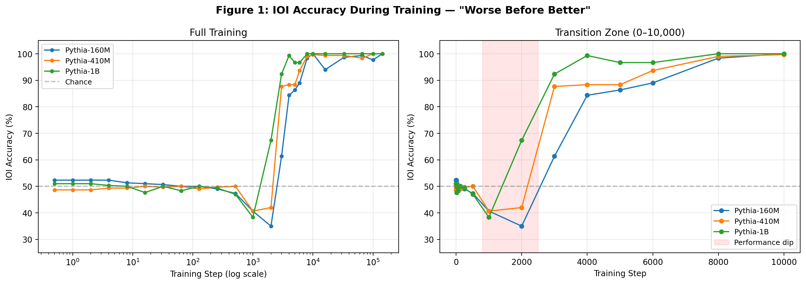
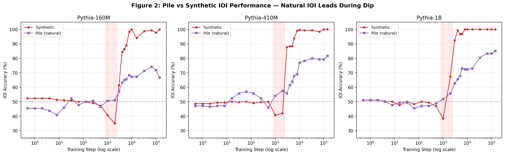
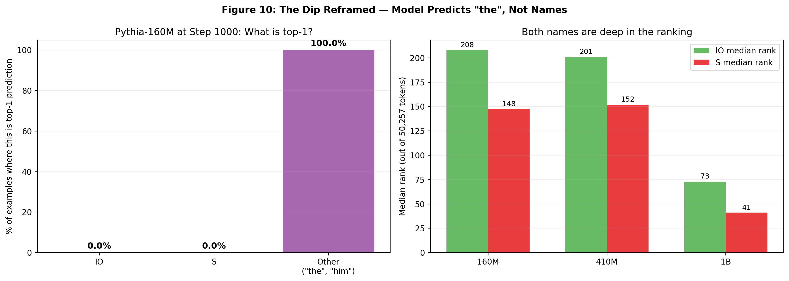
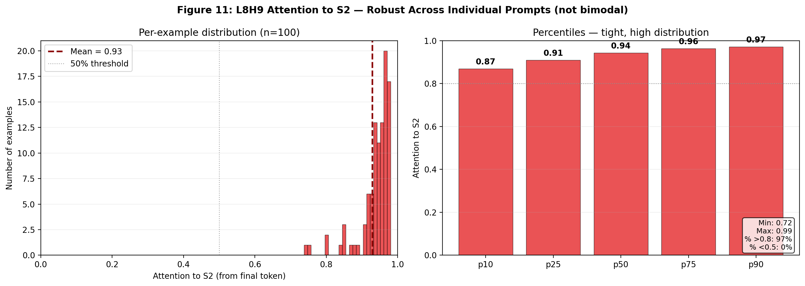
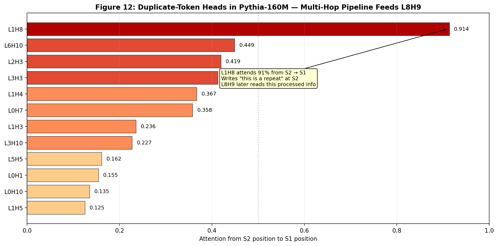
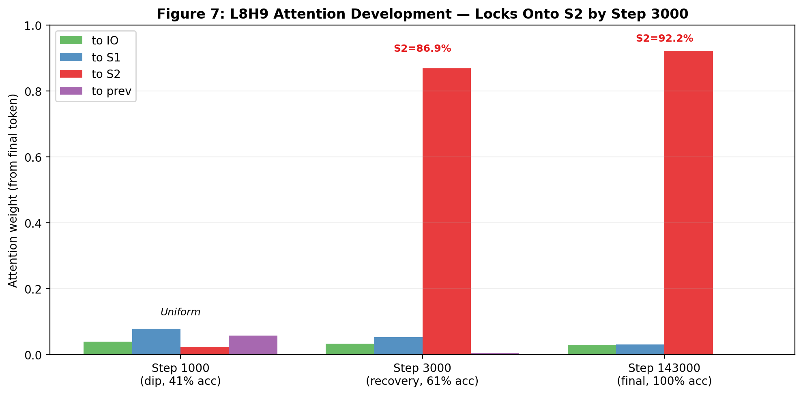
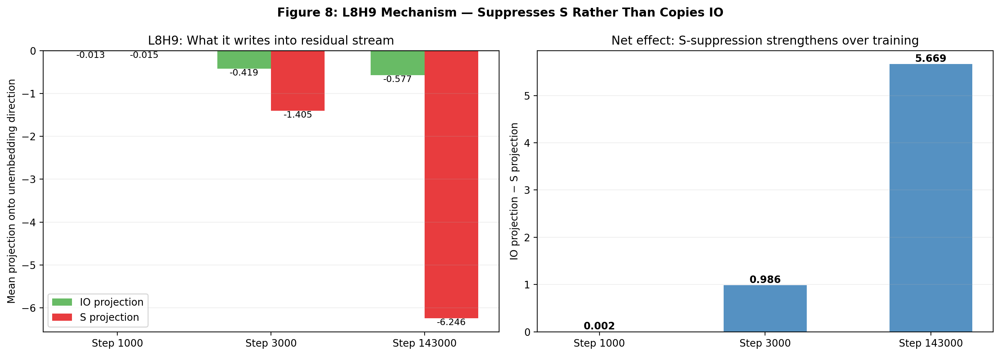
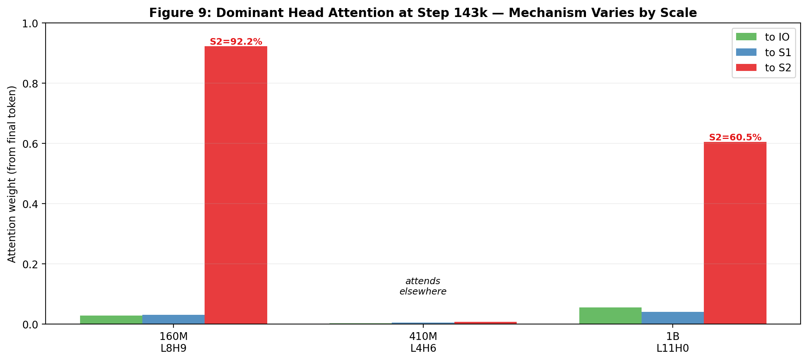
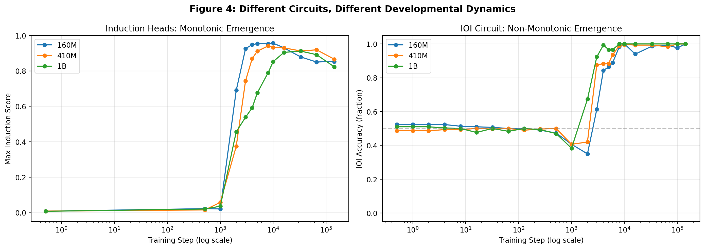

# IOI Circuit Emergence During Training

**Investigating when and how the Indirect Object Identification (IOI) circuit emerges during Pythia language model training, across three model scales.**

**Author:** Tejas Dahiya, UW-Madison
**Advisor:** Cole Blondin
**Target:** ICML 2026 Mechanistic Interpretability Workshop (deadline May 8, 2026)

---

## TL;DR

We track IOI circuit emergence across Pythia-160M, 410M, and 1B. Four main findings:

1. **A non-monotonic accuracy dip at step 1000 replicates across all three scales** — but the "dip" reflects the model predicting function words (like "the") rather than systematically choosing the wrong name.
2. **Heads classified as name-movers during the dip have near-uniform attention patterns** and write essentially zero into the output direction. Standard ablation-based classification can be misleading during early training.
3. **The dominant head in Pythia-160M (L8H9) implements IOI through S-suppression as the output of a multi-hop pipeline.** L8H9 attends 92% to S2 (with low variance across examples) and reads a processed representation prepared by earlier duplicate-token heads — most strongly L1H8, which attends 91% from S2 → S1. L8H9 then writes a strong negative S signal (−6.25 at step 143k) into the final-position residual stream.
4. **This mechanism does NOT universally generalize.** Pythia-1B's L11H0 shows a similar but weaker pattern (60% to S2), while Pythia-410M's L4H6 uses a different mechanism entirely, attending 57% to the final token position.

---

## Finding 1: The "Worse Before Better" Dip — Replicates at Scale

All three Pythia models show accuracy dropping below chance at step 1000:

| Step | 160M | 410M | 1B |
|------|------|------|-----|
| 0 | 52% | 49% | 51% |
| 512 | 47% | 50% | 47% |
| **1000** | **41%** | **41%** | **38%** |
| 2000 | 35% | 42% | 67% |
| 3000 | 61% | 88% | 92% |
| 8000 | 98% | 99% | 100% |

Larger models dip deeper but recover faster. 1B reaches 100% by step 8000, 160M by step 10000.



---

## Finding 2: Pile (Natural) IOI Leads Synthetic During the Dip

Across all three models, natural IOI accuracy on Pile text stays near 50% while synthetic accuracy drops to 38-41%:

| Step | 160M Syn | 160M Pile | 410M Syn | 410M Pile | 1B Syn | 1B Pile |
|------|----------|-----------|----------|-----------|--------|---------|
| 1000 | 41% | **51%** | 41% | **54%** | 38% | **52%** |
| 2000 | 35% | **51%** | 42% | **58%** | 67% | 56% |

Once the circuit organizes (step 3000+), synthetic reaches 100% but Pile climbs more slowly: 160M peaks at 74% then drops to 67%, 410M plateaus at 82%, 1B plateaus at 85%.



---

## Finding 3: The Dip Reframed — Names Aren't Even in Consideration

At step 1000, neither name is anywhere near the model's prediction. Both sit at rank 150–210 with probabilities around 0.05–0.07%. The model predicts "the" 95% of the time. The "60% S-preference" amounts to a 0.02 percentage point probability difference — essentially noise.

The real developmental story is when names enter consideration at all:

| Step | IO rank | IO prob | S rank | S prob | IO is top-1 | Accuracy |
|------|---------|---------|--------|--------|-------------|----------|
| 1000 | 208 | 0.05% | 147 | 0.07% | 0.0% | 41% |
| 2000 | 13 | 1.13% | 7 | 1.91% | 0.3% | 35% |
| 3000 | **4** | **5.77%** | 6 | 3.07% | 11.0% | 61% |
| 5000 | 3 | 11.3% | 12 | 1.57% | 22.3% | 86% |
| 8000 | 1 | 19.4% | 8 | 1.62% | 47.3% | 98% |
| 143000 | **0** | **34.6%** | 14 | 1.04% | 62.7% | 100% |

Three phases:
1. **Step 1000:** Both names at rank 150–210, probability ~0.05%. The model hasn't learned that names belong here.
2. **Steps 2000–3000:** Names climb into the top 15. IO overtakes S at step 3000 (rank 4, 5.8% vs rank 6, 3.1%) — precisely when L8H9 locks onto S2.
3. **Steps 5000+:** IO reaches top 1–3, probability 11–35%. S stays at rank 8–14. The circuit is fully functional.

The "below-chance accuracy" at step 1000 is real but misleading in isolation. The model is not "choosing the wrong name" — it is not predicting names at all.



---

## Finding 4: Early "Name-Movers" Are Mechanistically Empty

Three heads in layer 0 (L0H5, L0H6, L0H10) pass the standard name-mover classification at step 1000 in Pythia-160M. But:

**Attention patterns are essentially uniform:**

| Head | to IO | to S1 | to S2 | to prev |
|------|-------|-------|-------|---------|
| L0H5 | 0.045 | 0.045 | 0.053 | 0.049 |
| L0H6 | 0.058 | 0.057 | 0.057 | 0.067 |
| L0H10 | 0.062 | 0.062 | 0.063 | 0.056 |

**Output projections onto IO/S directions are near zero:**

| Head | Step 1000 diff | Step 3000 diff | Step 143000 diff |
|------|---------------|---------------|-----------------|
| L0H5 | −0.0002 | −0.0013 | +0.0006 |
| L0H6 | −0.0007 | −0.0003 | −0.0006 |
| L0H10 | +0.0004 | −0.0012 | **−0.0129 (S-promoting)** |

These heads are not mechanistically doing name-moving. They pass our ablation-based metric by accident of small perturbations. By step 143000, L0H10 has even developed a mild S-promoting bias, which explains why ablating it improves accuracy.

**Takeaway for the field:** ablation-based circuit-component classification during early training produces false positives. Attention patterns and output projections are more reliable mechanistic signals.

---

## Finding 5: L8H9 Suppresses S — As the Output of a Multi-Hop Pipeline

In Pythia-160M at step 143000, L8H9 is the dominant head (−18.3pp when ablated). Its mechanism has two parts: what it attends to, and what it writes.

**Attention is remarkably consistent — not an averaging artifact:**

Across 300 prompts, L8H9's attention to S2 has:
- Mean: 0.929 (std: 0.048)
- Min: 0.72, Max: 0.99
- **97% of examples have >80% attention to S2**
- **0% of examples have <50% attention to S2**

The 92% mean is not hiding bimodal behavior — essentially every example shows strong S2 attention.



**L8H9 is not reading "raw S" — it reads a processed S2 representation prepared by earlier heads.**

Scanning all heads in layers 0–7, we find a clear duplicate-token pipeline feeding into the S2 position. L1H8 attends from S2 back to S1 with weight **0.914**, writing "this token is a repeat" at S2. Several other heads (L6H10=0.45, L2H3=0.42, L3H3=0.41) provide additional processing.



**The full mechanism:**

1. **L1H8** (layer 1) attends S2 → S1, writes duplicate-token signal at S2
2. **Other duplicate-token heads** (L6H10, L2H3, L3H3) add further processing at S2
3. **L8H9** (layer 8) attends final → S2, reads the processed S-representation
4. **L8H9 writes strong negative S** into the final-position residual stream

**Output projection (what L8H9 writes):**
- Step 1000: IO=−0.013, S=−0.015 (writes essentially nothing)
- Step 3000: IO=−0.419, S=**−1.405** (suppresses both, S 3× more)
- Step 143000: IO=−0.577, S=**−6.246** (massively suppresses S)

The net S-suppression (IO − S projection) grows from +0.002 → +0.986 → **+5.669** across training. By suppressing S in the logits, IO wins by default.

**L8H9 does NOT copy IO** the way Wang et al. (2022) describe name-movers. It implements IOI as the output stage of a multi-hop S-suppression pipeline. Same behavioral effect (IO wins), fundamentally different mechanism.





---

## Finding 6: Mechanism Does NOT Universally Generalize Across Scales

The S2-attending mechanism is 160M-specific. At step 143000:

| Model | Dominant head | Attn to IO | Attn to S1 | Attn to S2 | Mechanism |
|-------|---------------|------------|------------|------------|-----------|
| 160M | L8H9 | 0.029 | 0.031 | **0.922** | S2-suppression |
| 410M | L4H6 | 0.003 | 0.005 | 0.007 | **Attends to final position (57%)** |
| 1B | L11H0 | 0.055 | 0.041 | **0.605** | Partial S2-suppression |

Pythia-410M's L4H6 attends **57.5% to itself** (the final token position) and 39.5% to scattered other positions. It does not read S2. It must operate by reading information earlier layers have already written into the final-position residual stream. This is a distinct mechanism.

**Implication:** different Pythia scales converge on different circuit solutions. Scaling doesn't guarantee mechanistic uniformity.



---

## Finding 7: Dominant Head Ablation on Pile — Scale-Dependent Dependence

Ablating the dominant head at step 143000 and measuring Pile accuracy:

| Model | Pile baseline | Pile ablated | Drop | Synthetic drop (comparison) |
|-------|-------------|-------------|------|----------------------------|
| 160M | 65.6% | 55.2% | −10.4pp | −18.3pp |
| 410M | 80.9% | 43.8% | **−37.2pp** | ~−18pp |
| 1B | 86.8% | 82.6% | −4.2pp | ~−18pp |

- **160M:** circuit matters for Pile but less than synthetic (backup mechanisms exist)
- **410M:** Pile is MORE dependent on L4H6 than synthetic — ablation crashes Pile accuracy below chance
- **1B:** highly redundant — natural IOI barely depends on the dominant head

---

## Finding 8: Why Pile Doesn't Dip — L8H9 Doesn't Engage With Pile

At step 1000, L8H9's attention patterns differ sharply between synthetic and Pile:

| Context | to IO | to S1 | to S2 |
|---------|-------|-------|-------|
| Synthetic | 0.040 | 0.079 | 0.023 |
| Pile | 0.017 | 0.011 | 0.008 |

On Pile text, the half-formed L8H9 barely fires. It recognizes synthetic templates as IOI problems and starts developing an S1 bias; it doesn't recognize Pile text as the same task. **This explains why Pile doesn't dip below chance** — the emerging (broken) circuit doesn't engage with natural text.

---

## Finding 9: Induction Heads as a Monotonic Control

In contrast to IOI's non-monotonic dynamics, induction heads emerge **monotonically** across all three models — a smooth climb from 0 to ~0.9 with no dip, no reorganization. This suggests the "worse before better" pattern is specific to circuits requiring multi-head coordination.



---

## Additional Results

- **Prefix robustness:** stripping the 5 tokens before IO in Pile prompts drops accuracy from 65.6% → 50.3%. The prefix carries real signal, so our Pile accuracy is likely a lower bound.
- **General baseline:** Pythia-160M's general next-token accuracy on Pile text is 29.2% while IOI accuracy is 65.6%. The model is substantially better at IOI than general prediction.
- **L8H9 at step 143000:** ablating it drops synthetic accuracy 100% → 81.7% (−18.3pp), even more critical than at step 3000. No late-emerging backup heads meaningfully replace it.

---

## Limitations

1. **"In Pythia" not "in general."** Wang et al. studied GPT-2 Small. Our findings describe Pythia-specific circuit development. The discrepancy between L8H9's S2-attending mechanism and Wang et al.'s description may reflect architectural or training-data differences.
2. **Three checkpoints in the transition zone (512, 1000, 2000) is low resolution.** Dense checkpoints via retraining would clarify the mechanism's formation step-by-step.
3. **Component counting with tau=0.02 is noisy.** We attempted to track name-mover, S-inhibition, duplicate-token, previous-token, and negative-name-mover populations via ablation metrics. Results produce 49 "negative name movers" at 100% accuracy — clearly too loose a threshold. We report counts as supplementary only.
4. **L8H9 projection is averaged across examples.** We verified attention is consistent per-example (97% of examples >0.8 attention to S2), but output projections are still means. A small number of examples may behave differently.
5. **The multi-hop pipeline is shown for 160M only.** We identified L1H8 and other duplicate-token heads feeding L8H9 in Pythia-160M. Whether the same pipeline structure exists in 410M and 1B requires further investigation.

---

## Dataset

**Synthetic IOI:** Wang et al. 2022 templates. 136 names, 30 templates (15 ABBA + 15 BABA), 300 prompts per checkpoint.

**Natural IOI (Pile):** 288 examples extracted from EleutherAI/the_pile_deduplicated (Pythia's training data). Scanned 13.9M texts. Removed bAbI synthetic QA contamination (42% of initial finds). 174 examples with single-token IO names used for evaluation.

---

## Repo Structure

```
scripts/
  dev_interp_checkpoints.py          # Part 1: component emergence per checkpoint
  dev_interp_pile_vs_synthetic.py    # Part 2: Pile vs synthetic comparison
  parse_pile_ioi.py                  # Pile IOI extraction
  quick_experiments.py               # Prefix, baseline, final ablation
  mega_experiments.py                # Main experiments (A,B,C,D,E)
  fix_exp_a.py                       # L8H9 output projection
  check_dominant_attn.py             # Dominant head attention across scales
  final_probes.py                    # 3 follow-up probes
  distribution_and_multihop.py       # L8H9 per-example distribution + pipeline analysis
  plot_all_figures.py                # Figures 1–6
  plot_mega_figures.py               # Figures 7–10
  plot_distribution_multihop.py      # Figures 11–12
data/
  pile_ioi_natural.json              # 288 clean Pile IOI examples
  example_prompts.txt
results/
  part1_component_emergence.json                           # 160M Part 1
  dev_interp_EleutherAI_pythia-410m-deduped.json           # 410M Part 1
  dev_interp_EleutherAI_pythia-1b-deduped.json             # 1B Part 1
  part2_pile_vs_synthetic.json                             # 160M Part 2
  dev_interp_grokking_EleutherAI_pythia-410m-deduped.json  # 410M Part 2
  dev_interp_grokking_EleutherAI_pythia-1b-deduped.json    # 1B Part 2
  ablation_early_nms.json            # 160M early NM ablations
  ablation_cross_scale.json          # 410M + 1B ablations
  induction_emergence.json           # Induction tracking, all 3 models
  quick_experiments.json             # Prefix, L8H9 final, baseline
  mega_experiments.json              # Projections, attention, probes
  head_tracking_160m.txt             # Individual head tracking
figures/
  fig1_accuracy_across_training.png  # IOI accuracy, 3 models
  fig2_pile_vs_synthetic.png         # Pile vs synthetic, 3 subplots
  fig3_components_vs_accuracy.png    # Name-mover count vs accuracy
  fig4_induction_vs_ioi.png          # Monotonic vs non-monotonic
  fig5_ablation_results.png          # Ablation bar charts
  fig6_head_succession.png           # Dominant head timeline
  fig7_l8h9_attention_development.png    # L8H9 attention across training
  fig8_l8h9_output_projection.png    # L8H9 mechanism: S-suppression
  fig9_dominant_head_scales.png      # Mechanism varies by scale
  fig10_top_predictions.png          # The dip reframed
  fig11_l8h9_distribution.png        # Per-example attention distribution (not bimodal)
  fig12_multihop_pipeline.png        # Duplicate-token heads feeding L8H9
```

---

## References

- Wang et al. 2022. "Interpretability in the Wild: a Circuit for Indirect Object Identification in GPT-2 Small"
- Biderman et al. 2023. "Pythia: A Suite for Analyzing Large Language Models Across Training and Scaling"
- Olsson et al. 2022. "In-context Learning and Induction Heads"
- Nanda et al. 2023. "Progress measures for grokking via mechanistic interpretability"
