# IOI Circuit Emergence During Training

Investigating when and how the Indirect Object Identification (IOI) circuit emerges during language model training.

**Author:** Tejas Dahiya, UW-Madison
**Advisor:** Cole Blondin
**Targets:** ICML 2026 Mech Interp Workshop / EMNLP 2026

## Summary

We track IOI circuit formation across 18 independent training runs spanning two model families (Pythia and Stanford GPT-2), three Pythia scales (160M, 410M, 1B), 9 PolyPythias seed variants, and a retrained Pythia-160M with 103 dense checkpoints. We also compare against Pile (natural) IOI and induction head emergence as controls.

**Core findings:**

1. **The dip is universal.** All 18 runs show IOI accuracy dropping below chance (50%) in early training. The dip is invariant to random seed, data ordering, weight initialization, model scale, and model family.

2. **S-inhibition, not name-moving, is the primary mechanism.** The head with the largest ablation effect consistently attends to the repeated subject token (S2) and suppresses it, rather than attending to IO and copying it. S-suppression contributes 2-10x more to the logit difference than IO-copying.

3. **Recovery is noisy, not a phase transition.** Dense checkpoints reveal repeated circuit formation and collapse during recovery.

4. **The circuit implementation is seed-dependent.** Retraining and PolyPythias analysis shows every seed produces a different circuit (n=5 seeds, 5 different heads, 0 repeats): different heads, different mechanisms (direct S2 attention vs indirect relay), even opposite roles for the same head. The architecture demands S-inhibition; it does not care which head provides it.

---

## Part I: The Dip

### Finding 1: The Dip Replicates Across Scales and Families

All models show IOI accuracy dropping below 50% in early training.

**Pythia (3 scales, The Pile):**

| Step | 160M | 410M | 1B |
|------|------|------|-----|
| 0 | 52% | 49% | 51% |
| 1000 | **41%** | **41%** | **38%** |
| 2000 | 35% | 42% | 67% |
| 3000 | 61% | 88% | 92% |
| 8000 | 98% | 99% | 100% |

Larger models recover faster: 1B reaches 100% by step 8000, 160M by step 10000.

**Stanford GPT-2 Small (2 seeds, OpenWebText):**

| Step | Alias (seed 21) | Battlestar (seed 49) |
|------|----------------|---------------------|
| 1000 | **30%** | **25%** |
| 1500 | **10%** | -- |
| 2000 | 16% | **12%** |
| 10000 | 59% | 68% |
| 50000 | 100% | 100% |

Stanford GPT-2 dips deeper (10%) and recovers slower than Pythia.

**Retrained Pythia-160M (seed=42, 103 checkpoints):**

| Step | Accuracy |
|------|----------|
| 950 | **29%** |
| 1400 | **22%** |
| 3000 | 42% |
| 6000 | 86% |
| 10000 | 88% |

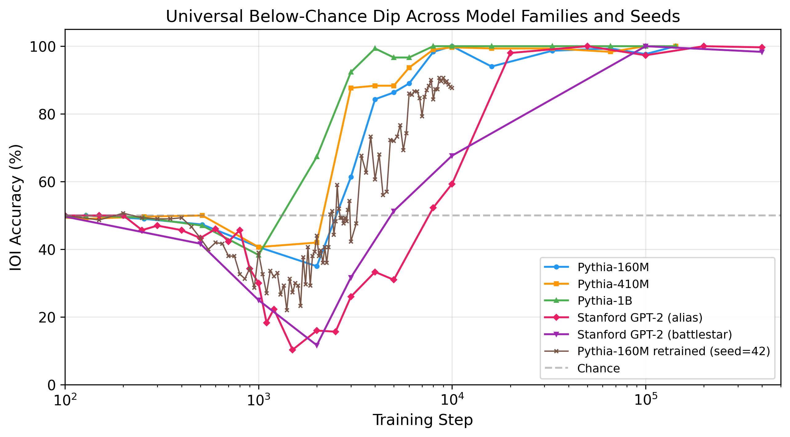

### Finding 2: Not Seed, Not Data Order, Not Weight Init

Using EleutherAI's PolyPythias, we tested 9 Pythia-160M variants. All 9 dip.

| Step | seed1 | seed3 | seed5 | d-s1 | d-s2 | d-s3 | w-s1 | w-s2 | w-s3 |
|------|-------|-------|-------|------|------|------|------|------|------|
| 1000 | **38%** | **31%** | **42%** | **42%** | **36%** | **41%** | **43%** | **44%** | **39%** |
| 2000 | **32%** | **18%** | **34%** | **29%** | **28%** | **35%** | **33%** | **37%** | **31%** |
| 3000 | 80% | 73% | 61% | 70% | 59% | 83% | 65% | 72% | 73% |

- **data-seed** variants (same weights, different data order): all dip.
- **weight-seed** variants (same data, different weights): all dip.

The dip is architectural.

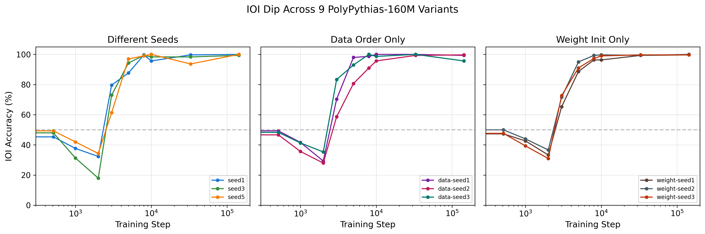

### Finding 3: Names Are Not in Consideration During the Dip

At step 1000, both IO and S names sit at rank 150-210 out of 50,257 tokens. The model predicts "the" 95% of the time. The "60% S-preference" is a 0.02 percentage point probability difference.

| Step | IO rank | IO prob | S rank | S prob | IO top-1 |
|------|---------|---------|--------|--------|----------|
| 1000 | 208 | 0.05% | 147 | 0.07% | 0.0% |
| 2000 | 13 | 1.13% | 7 | 1.91% | 0.3% |
| 3000 | 4 | 5.77% | 6 | 3.07% | 11.0% |
| 8000 | 1 | 19.4% | 8 | 1.62% | 47.3% |
| 143000 | 0 | 34.6% | 14 | 1.04% | 62.7% |

IO overtakes S at step 3000, precisely when L8H9 locks onto S2.

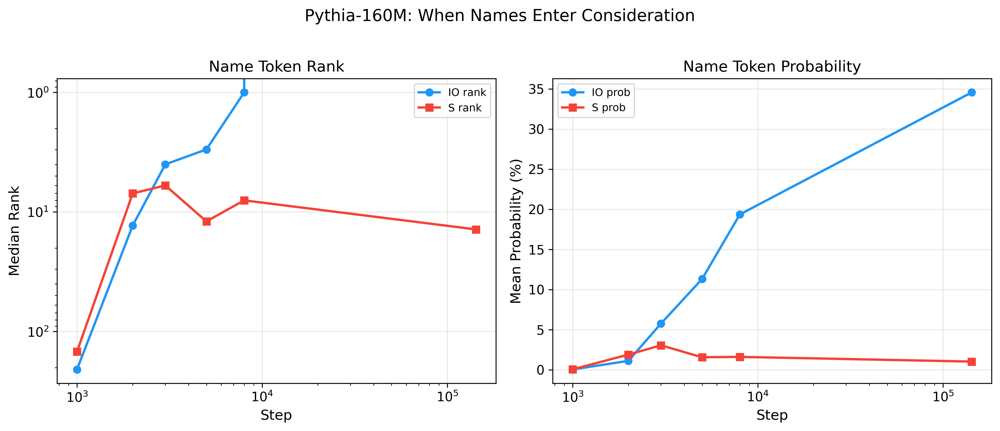

### Finding 4: Pile (Natural) IOI Stays at Chance During the Dip

On all three Pythia models, Pile IOI accuracy stays near 50% while synthetic drops to 38-41%.

| Step | 160M Syn | 160M Pile | 410M Syn | 410M Pile | 1B Syn | 1B Pile |
|------|----------|-----------|----------|-----------|--------|---------|
| 1000 | 41% | **51%** | 41% | **54%** | 38% | **52%** |
| 2000 | 35% | **51%** | 42% | **58%** | 67% | 56% |

At step 1000, L8H9 barely fires on Pile text (S2 attention 0.8% vs synthetic 2.3%). The half-formed circuit recognizes synthetic templates as IOI problems but does not engage with natural text. This is why Pile does not dip.

Late training: Pile peaks at 74% (160M), 82% (410M), 85% (1B). 160M then drops to 67% -- late degradation is a small-model phenomenon.

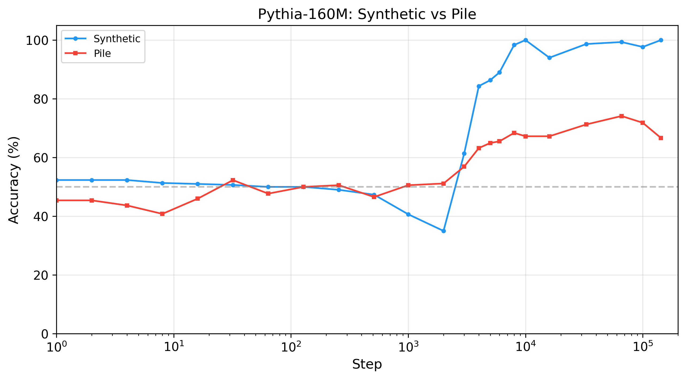

### Finding 5: Recovery Is Noisy, Not a Phase Transition

Stanford GPT-2's 609 checkpoints (61 data points in the 500-5000 range) and our retrained Pythia-160M (103 dense checkpoints) both show oscillatory recovery:

Phase 1 -- Gradual descent (steps 500-1450): accuracy drops from 43% to 9%.
Phase 2 -- Noisy bottom (steps 1350-2500): oscillations between 6-27%.
Phase 3 -- Noisy recovery (steps 2500-5000): hits 50% at step 4100, drops to 24% at step 4300.

Verified with n=600 examples (not sampling noise):

| Step | n=300 | n=600 | SE |
|------|-------|-------|-----|
| 3700 | 43.0% | 40.8% | 2.0% |
| 4100 | 50.0% | 50.0% | 2.0% |
| 4300 | 20.3% | 24.3% | 1.8% |

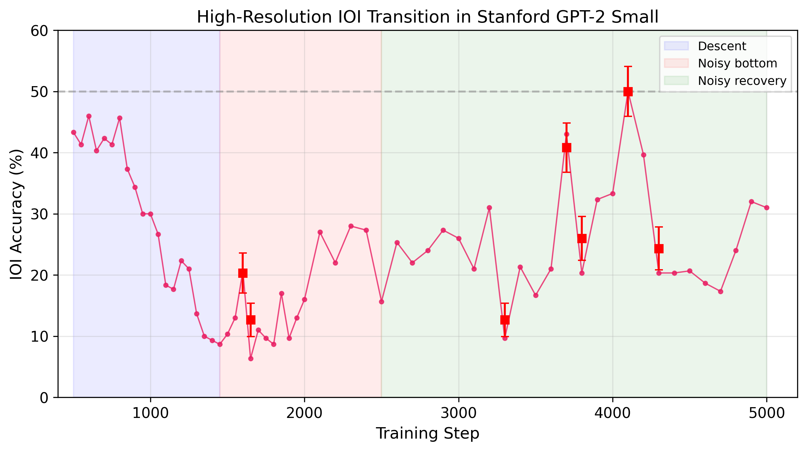
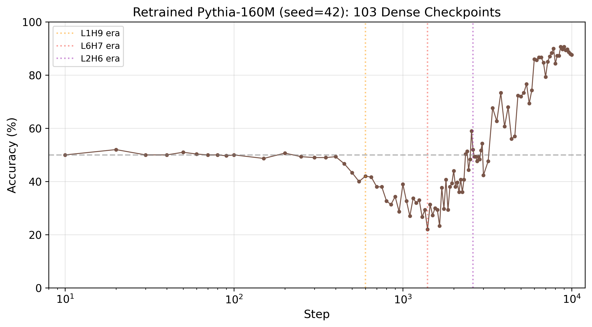

---

## Part II: The Mechanism

### Finding 6: Early "Name Movers" Are Mechanistically Empty

At step 1000, three heads in Pythia-160M (L0H5, L0H6, L0H10) pass the name-mover classification threshold. But:
- Attention patterns are uniform (~5-6% to every position, no preference for IO or S)
- Output projections onto IO/S directions are near zero (~0.001 at every training step)

These heads pass the ablation metric by accident. They are not doing name-moving.

### Finding 7: Early Heads Flip From Helpful to Harmful

| Head | Step 1000 (ablate) | Step 3000 (ablate) |
|------|-------------------|-------------------|
| L0H10 | -2.3pp (helps) | **+11.7pp** (hurts) |
| L0H6 | -2.0pp (helps) | 0pp (neutral) |
| All early NMs | -5.0pp | +2pp |
| **L8H9** | -0.3pp (irrelevant) | **-17pp** (critical) |

The circuit reorganizes between steps 1000-3000. Early components that helped during the dip become harmful once the dominant head takes over.

### Finding 8: The Dominant Head Is S-Inhibition, Not a Name Mover

The head with the largest single-head ablation effect in Pythia-160M (L8H9) is NOT a name mover. Under Wang et al.'s attention-based classification, it is an S-inhibition head.

- L8H9 attends 92.5% to S2
- L8H9 writes IO=-0.47, S=-6.22 (projection diff = +5.74)
- Wang et al. classification: S-inhibition
- Attention is consistent: 97% of prompts have >0.8 S2 attention, not bimodal

The actual IO-copier (name mover) is L8H1:
- L8H1 attends 72.4% to IO
- L8H1 writes IO=+1.23, S=+0.70 (projection diff = +0.53)

S-suppression (+5.74) contributes **10.8x** more than IO-copying (+0.53).

There is also a negative name mover (L9H1): attends 83.6% to IO but writes negative IO (-1.32).

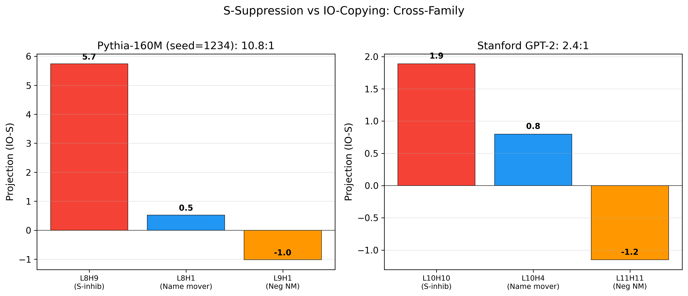

### Finding 9: The Multi-Hop Pipeline

The IOI circuit in Pythia-160M is a multi-hop pipeline:

1. **L1H8** (layer 1): attends 91.4% from S2 to S1 (duplicate token detection)
2. Other heads (L6H10=44.9%, L2H3=41.9%, L3H3=41.3%) add processing at S2
3. **L8H9** (layer 8): reads the processed S2 representation, writes -6.22 S-suppression
4. **L8H1** (layer 8): reads IO, writes +1.23 IO-copying
5. IO wins because S-suppression dominates IO-copying

### Finding 10: L8H9 Undergoes a Phase Transition

Tracking L8H9's attention to S2 across 24 checkpoints:

| Step | L8H9 to S2 | Accuracy |
|------|-----------|----------|
| 1000 | 0.022 | 41% |
| 2000 | **0.009** | 36% |
| 3000 | **0.857** | 58% |
| 4000 | 0.712 | 81% |
| 143000 | 0.926 | 100% |

L8H9 jumps from 0.009 to 0.857 between steps 2000-3000. The circuit snaps into place.

At step 143000, ablating L8H9 drops accuracy by -18.3pp (even more critical than -17pp at step 3000).

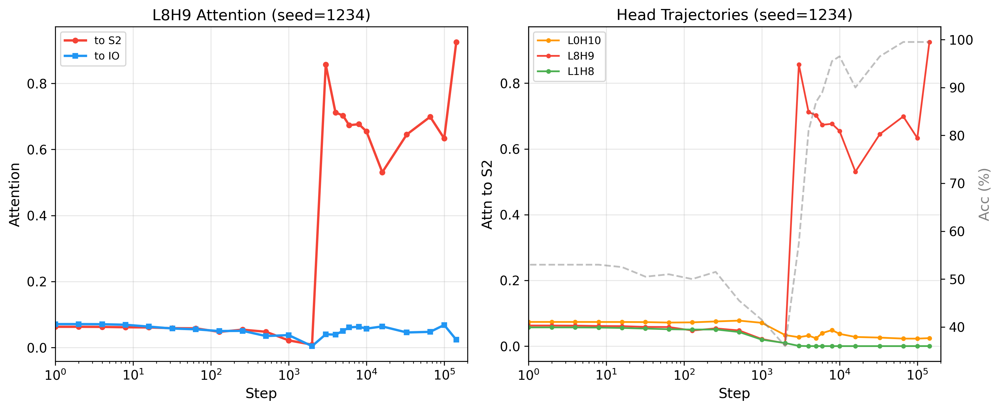

### Finding 11: S-Suppression Replicates Across Model Families

Stanford GPT-2's dominant head (L10H10) is also S-inhibition:

| Property | Pythia L8H9 | Stanford L10H10 |
|----------|-------------|----------------|
| Wang classification | S-inhibition | S-inhibition |
| Attention to S2 | 92.5% | 59.3% |
| S projection | -6.22 | -1.94 |
| IO-S diff | +5.74 | +1.89 |
| S-supp / IO-copy ratio | 10.8:1 | 2.4:1 |

Stanford also has a negative name mover (L11H11): attends 64% to IO, writes negative IO (-1.39), matching Pythia's L9H1.

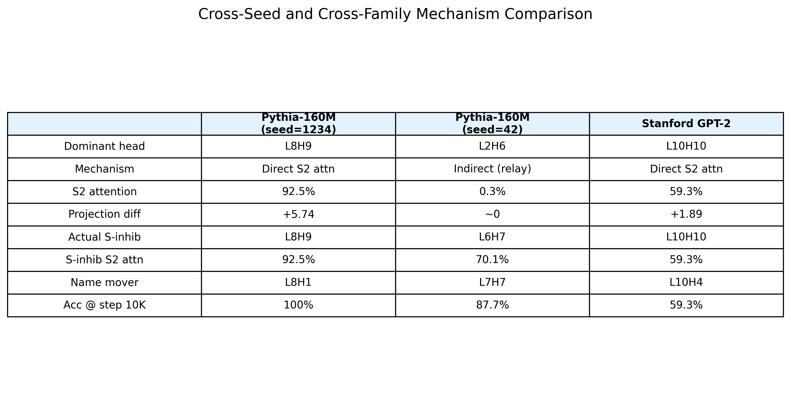

### Finding 12: Head Succession Varies by Scale

Each Pythia model develops a different number of dominant heads:

- **160M:** One dominant head. L8H9 from step 3000 onward.
- **410M:** Three in succession. L5H2 -> L12H12 -> L4H6.
- **1B:** Two in succession. L8H7 -> L11H0.

410M's final dominant head (L4H6) sits at layer 4/24 (17% depth) with near-zero output projection (IO=-0.024, S=-0.026). It works through indirect downstream effects.

### Finding 13: Pile Ablation Is Scale-Dependent

Ablating the dominant head at step 143000 on Pile (natural IOI):

| Model | Pile baseline | Pile ablated | Drop |
|-------|-------------|-------------|------|
| 160M | 65.6% | 55.2% | -10.4pp |
| 410M | 80.9% | 43.8% | **-37.2pp** |
| 1B | 86.8% | 82.6% | -4.2pp |

160M: circuit matters but backups exist. 410M: MORE dependent on dominant head for Pile than synthetic. 1B: highly redundant.

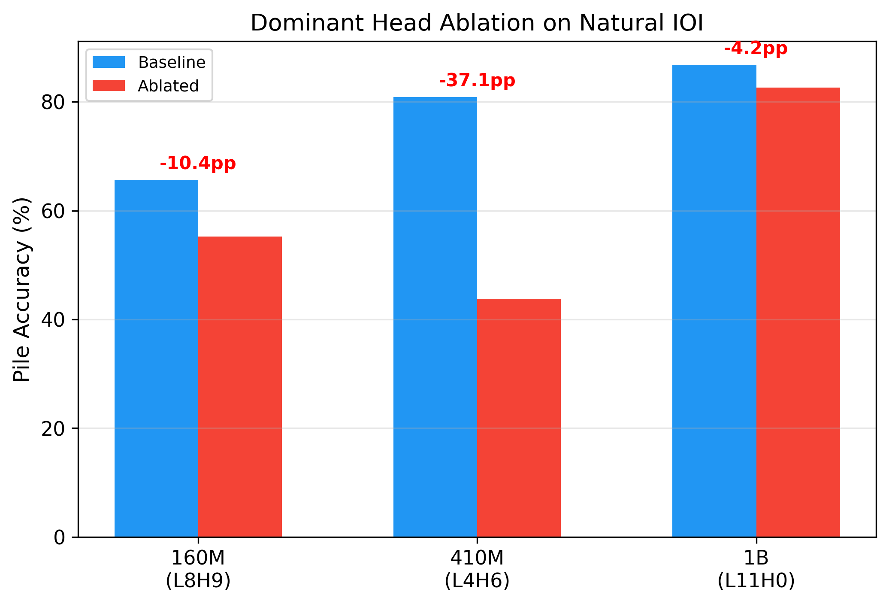

---

## Part III: Retraining Reveals Circuit Degeneracy

### Finding 14: Different Seeds Produce Different Circuits

Retraining Pythia-160M with seed=42 (10K steps, 103 checkpoints, 2M tokens/step, identical architecture and optimizer) produces a completely different circuit:

| Property | Original (seed=1234) | Retrained (seed=42) |
|----------|---------------------|---------------------|
| Dominant head (ablation) | L8H9 | L2H6 |
| Mechanism | Direct S2 attention (92%) | Indirect relay (zero attention) |
| Actual S-inhibition head | L8H9 | L6H7 |
| S-inhib S2 attention | 92.5% | 70.1% |
| S-inhib proj diff | +5.74 | +0.25 |
| Name mover | L8H1 | L7H7 |
| Accuracy at step 10K | 97.7% | 87.7% |

L8H9 with seed=42 NEVER specializes (S2 attention stays below 0.05). It actually S-PROMOTES (projection diff = -0.13), the opposite of its role with seed=1234.

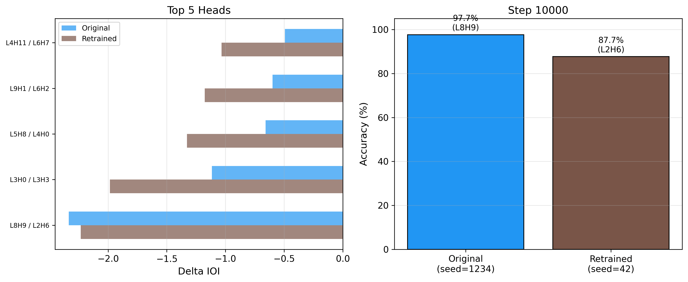

### Finding 15: Four Heads Compete for the S-Inhibition Role

The retrained model shows sequential head competition:

| Steps | Dominant Head | Mechanism |
|-------|--------------|-----------|
| 200-400 | L1H2 | Early, weak |
| 600-1200 | L1H9 | Self-attending |
| 1400-2400 | L6H7 | Direct S2 attention (up to 69%) |
| 2600-10000 | L2H6 | Indirect relay |

L6H7 implements genuine S-suppression (proj diff up to +0.25) just like original L8H9, but L2H6 eventually dominates by ablation despite having zero direct mechanism.

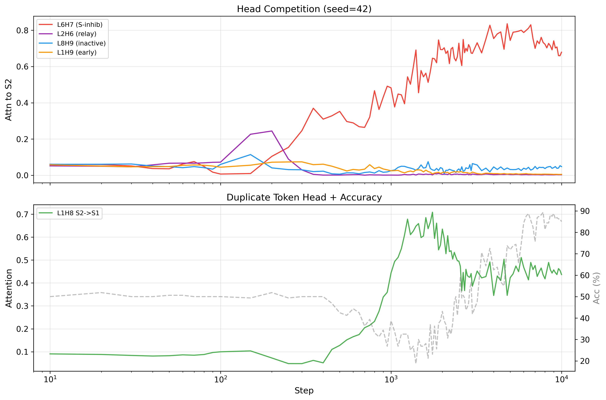
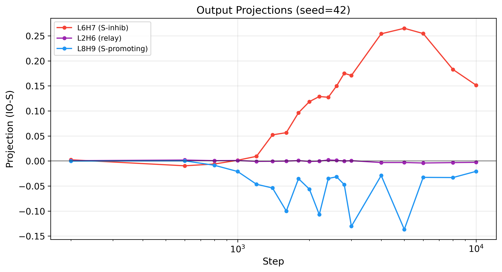

### Finding 16: L2H6 Is a Relay Head

Path patching reveals why L2H6 is dominant despite writing nothing. When L2H6 is zeroed, layer 7 heads lose their specialization:

| Head | Effect of zeroing L2H6 |
|------|----------------------|
| L7H7 | Loses IO attention (delta = -0.33) |
| L7H5 | Loses IO attention (delta = -0.28) |
| L7H3 | Loses S2 attention (delta = -0.33) |

L2H6 routes positional information to downstream heads. Remove it and three heads simultaneously go blind. This is the same "relay" architecture that 410M's L4H6 uses -- explaining the 410M mechanism divergence.

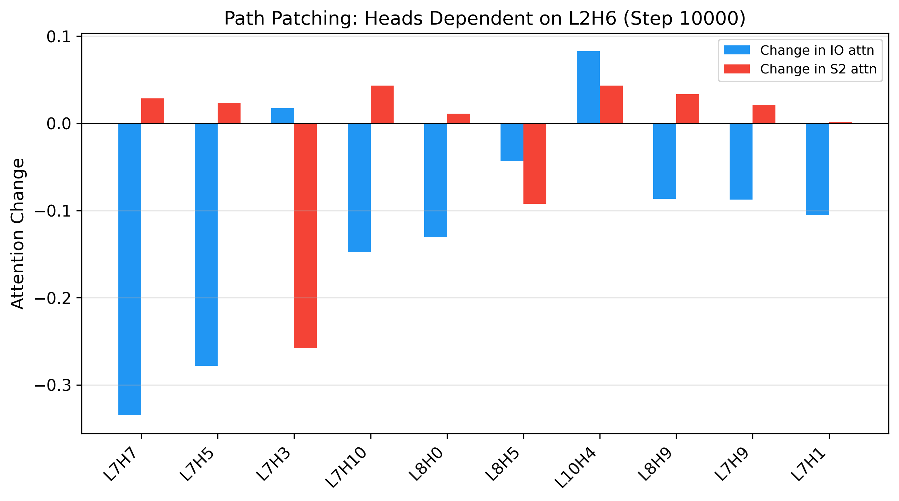

### Finding 17: IO Information Exists Before the Circuit Can Use It

Linear probes on the residual stream:

| Step | Best layer | Probe accuracy | IOI accuracy |
|------|-----------|----------------|-------------|
| 1000 | Layer 9 | 85% | 39% |
| 3000 | Layer 11 | 97.5% | 42% |
| 5000 | Layer 8 | 100% | 72% |
| 10000 | Layer 7 | 100% | 88% |

At step 1000 (during the dip), IO identity is decodable at 85% from the residual stream. The information is present; the circuit cannot extract it.

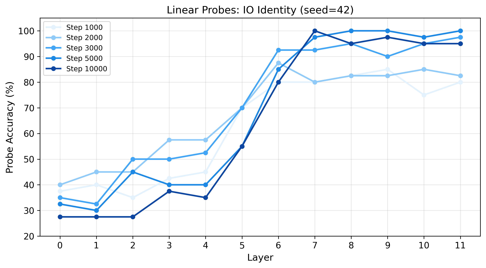

### Finding 18: S1 Is the Computational Bottleneck

Causal tracing (activation patching) shows restoring clean S1 activations recovers the most performance:

| Position | Recovery at step 10000 (layers 3-6) |
|----------|--------------------------------------|
| S1 | 217-267% |
| END | 100% |
| S2 | <10% |
| IO | <10% |

Recovery exceeding 100% means restoring S1 activations IMPROVES over the clean baseline. S1 at early-mid layers is where duplicate-token heads (L1H8) identify the repeated name.

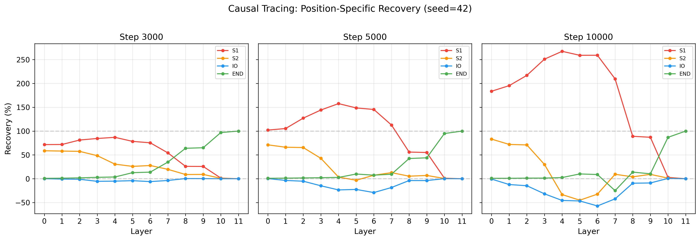

### Finding 20: Circuit Degeneracy Confirmed at n=5

Testing PolyPythias seeds 1, 3, and 5 at step 143000 reveals that every seed selects a different dominant head. Combined with the original and retrained models, we have n=5 with zero repeats:

| Seed | Dominant Head | Layer Depth | S2 Attention | Proj Diff | Mechanism |
|------|--------------|-------------|-------------|-----------|-----------|
| original (1234) | L8H9 | 67% | 92.5% | +5.74 | Direct S2-suppression |
| seed1 | L7H6 | 58% | 77.8% | +5.83 | Direct S2-suppression |
| seed3 | L7H11 | 58% | 85.4% | +4.35 | Direct S2-suppression |
| seed5 | L6H8 | 50% | 30.6% | +0.02 | Indirect relay |
| retrained (42) | L2H6 | 17% | 0.3% | ~0 | Indirect relay |

Two mechanisms: direct S2-suppression (3/5 seeds) where the head attends to S2 and writes strong negative S, and indirect relay (2/5 seeds) where the head routes information through downstream layers with near-zero direct projection. Both produce the same behavioral outcome.

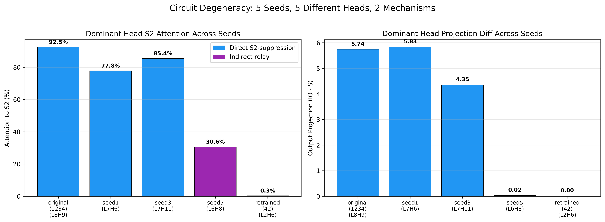

---

## Part IV: Methodology

### Finding 19: Ablation-Based Classification Is Unreliable

The number of heads classified depends on the threshold:

| Tau | Step 143000 NM | NegNM | % of heads |
|-----|---------------|-------|------------|
| 0.02 | 54 | 53 | 74% |
| 0.10 | 34 | 26 | 42% |
| 0.20 | 21 | 12 | 23% |

Wang et al. attention-based classification is more robust and correctly identifies L8H9 as S-inhibition.

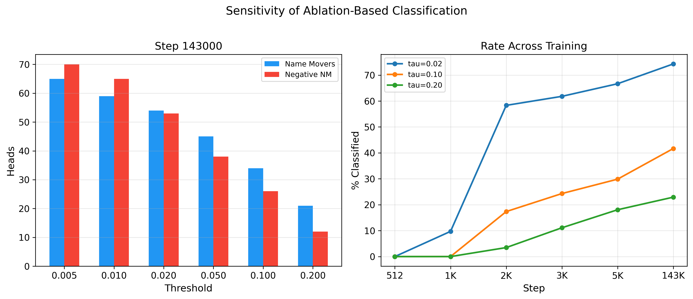
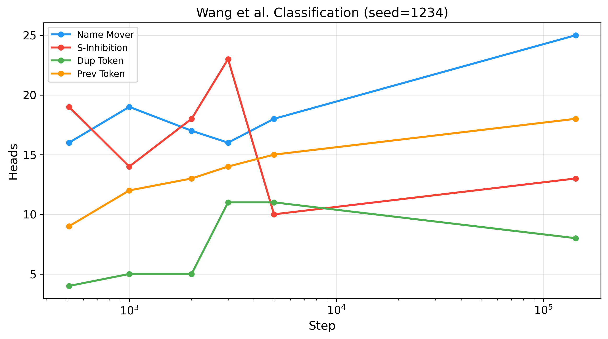

---

## Additional Results

**Induction heads as control:** Induction heads emerge monotonically across all three Pythia scales -- smooth climb from 0 to ~0.9 with no dip, no reorganization. The non-monotonic pattern is specific to circuits requiring multi-head coordination.

**Prefix robustness (160M, step 143000):** Stripping 5 tokens before IO in Pile prompts drops accuracy from 65.6% to 50.3%. The prefix carries real signal.

**General baseline:** General next-token accuracy on Pile text is 29.2% vs IOI accuracy of 65.6%. The model is substantially better at IOI than general prediction.

---

## Theoretical Perspective: Why S-Suppression?

Across all 5 seeds and both model families, S-inhibition consistently dominates IO-copying by 2-10x. We conjecture this is because repetition detection is informationally cheaper than unique-token identification.

**S-suppression requires duplicate detection.** The head compares two positions: "is the token at S2 the same as at S1?" This is a binary matching operation requiring O(1) bits of mutual information between positions. L1H8 implements exactly this -- attending 91.4% from S2 to S1 -- and it appears early in training (step 1000).

**IO-copying requires unique-token identification.** The head must determine: "which name is NOT repeated?" This requires first knowing which name IS repeated (i.e., duplicate detection must happen first), then selecting the exception from a vocabulary of 50,257 tokens. This requires O(log V) bits.

**The pipeline architecture confirms the dependency.** In every model we examined:
1. Duplicate-token heads (L1H8) emerge first and sit in early layers
2. S-inhibition heads read their output and suppress the repeated name
3. IO-copying heads contribute less because the problem is already mostly solved by suppression

**S-suppression is not just easier -- it is sufficient.** If the repeated name is suppressed, the non-repeated name wins by default without needing an explicit copying mechanism. The 10:1 ratio (Pythia) and 2.4:1 ratio (Stanford) reflect this: the circuit invests most of its capacity in the cheaper, sufficient strategy.

This explains both the universality of S-inhibition dominance and the degeneracy of circuit implementation. Any head can learn duplicate detection and S-suppression. The architecture does not need a specific head for this role -- it needs any head willing to do the cheap computation first.

---

## Limitations

1. All models are 124M-1B, English web text. Larger models untested.
2. S-suppression ratio varies across families (10:1 vs 2.4:1). Unknown why.
3. Five seeds tested (original, retrained, seed1, seed3, seed5). More would strengthen the degeneracy claim.
4. No theoretical explanation for why S-suppression is preferred or why the solution is degenerate.
5. L9H1/L11H11 negative name movers replicate cross-family but their role is not fully understood.
6. Retrained model reaches 88% at step 10K vs original's 100%. May need more training.
7. Pile vs synthetic comparison confounds template vs natural AND seen vs unseen during training.

---

## Dataset

**Synthetic IOI:** Wang et al. 2022 templates. 136 names, 30 templates (15 ABBA + 15 BABA), 300 prompts per checkpoint.

**Natural IOI (Pile):** 288 examples from EleutherAI/the_pile_deduplicated. Scanned 13.9M texts. Removed bAbI contamination (42% of initial finds). 174 single-token IO name examples used for evaluation.

---

## Repo Structure

```
scripts/
  dev_interp_checkpoints.py          # Component emergence (160M/410M/1B)
  dev_interp_pile_vs_synthetic.py    # Pile vs synthetic comparison
  mega_experiments.py                # Output projections, attention, ablations
  cole_followups.py                  # Rank/probability progression
  stanford_gpt2_analysis.py          # Stanford GPT-2 dip + mechanism + 2nd seed
  polypythias_fix.py                 # PolyPythias 9 variants
  polish_experiments.py              # Stanford classification, high-res curve
  final_three_experiments.py         # Head trajectories, tau sensitivity, Wang
  quick_experiments.py               # Prefix robustness, baseline
  retrain_pythia_160m.py             # Retrain Pythia-160M (seed=42)
  analyze_retrained.py               # IOI analysis on 103 retrained checkpoints
  deep_analysis_retrained.py         # Projections, trajectories, path patching,
                                     # Wang classification, linear probes, causal tracing
  parse_pile_ioi.py                  # Pile IOI extraction
  generate_all_figures.py            # Generate all 18 figures

data/
  pile_ioi_natural.json              # 288 Pile IOI examples
  example_prompts.txt

results/
  # Pythia original (3 scales)
  pythia_160m_component_emergence.json
  pythia_160m_pile_vs_synthetic.json
  pythia_160m_mega_experiments.json
  pythia_160m_rank_progression.json
  pythia_160m_early_nm_ablations.json
  pythia_160m_quick_experiments.json
  pythia_160m_trajectories_sensitivity_wang.json
  pythia_160m_head_tracking.txt
  pythia_410m_component_emergence.json
  pythia_410m_pile_vs_synthetic.json
  pythia_1b_component_emergence.json
  pythia_1b_pile_vs_synthetic.json
  pythia_cross_scale_ablations.json
  induction_emergence.json

  # Stanford GPT-2
  stanford_gpt2_ioi.json
  stanford_gpt2_polish.json
  stanford_gpt2_projections_volatile.json

  # PolyPythias
  polypythias_ioi.json
  polypythias_mechanism.json

  # Retraining (seed=42)
  retrain_training_log.json
  retrain_ioi_analysis.json
  retrain_160m_deep_analysis.json

figures/
  fig01_universal_dip                # Dip across 6 models, 2 families
  fig02_polypythias                  # 9 PolyPythias variants
  fig03_highres_transition           # 61-point Stanford transition
  fig04_rank_progression             # IO/S rank and probability
  fig05_head_trajectories_original   # L8H9 phase transition (seed=1234)
  fig06_mechanism_comparison         # S-suppression vs IO-copying
  fig07_sensitivity                  # Tau threshold sensitivity
  fig08_pile_vs_synthetic            # Pile vs synthetic IOI
  fig09_wang_classification          # Wang classification over training
  fig10_pile_ablation                # Cross-scale Pile ablation
  fig11_mechanism_summary            # Cross-seed/family comparison table
  fig12_retrained_trajectory         # Retrained 103-checkpoint accuracy
  fig13_head_succession_retrained    # Head competition (seed=42)
  fig14_projections_retrained        # Output projections (seed=42)
  fig15_linear_probes                # IO decodability by layer
  fig16_causal_tracing               # Activation patching
  fig17_path_patching                # L2H6 downstream dependencies
  fig18_original_vs_retrained        # seed=1234 vs seed=42 comparison
  fig19_circuit_degeneracy           # 5 seeds, 5 heads, 2 mechanisms
```

## Retrained Model Checkpoints

103 checkpoints of Pythia-160M (seed=42) available on HuggingFace (private):
https://huggingface.co/teys7007/pythia-160m-seed42-dense

## References

- Wang et al. 2022. "Interpretability in the Wild: a Circuit for Indirect Object Identification in GPT-2 Small"
- Biderman et al. 2023. "Pythia: A Suite for Analyzing Large Language Models Across Training and Scaling"
- van der Wal et al. 2025. "PolyPythias: Stability and Outliers across Fifty Language Model Pre-Training Runs"
- Olsson et al. 2022. "In-context Learning and Induction Heads"
- Stanford CRFM. "Mistral: A Journey towards Reproducible Language Model Training"
