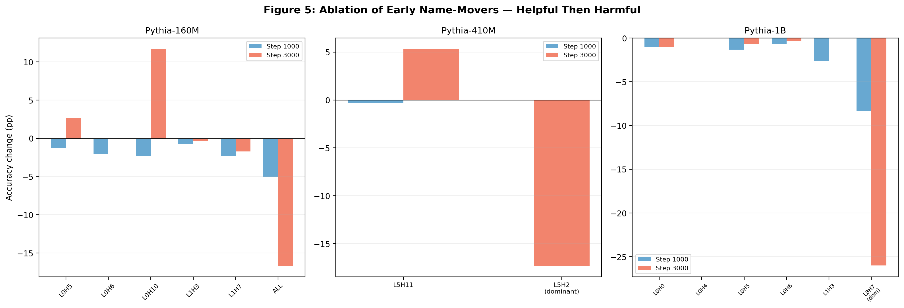
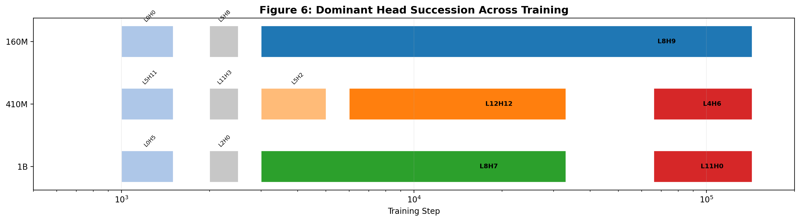

# IOI Circuit Emergence During Training

**Studying when and how the Indirect Object Identification (IOI) circuit emerges during language model training, across three Pythia model scales.**

**Author:** Tejas Dahiya, UW-Madison
**Advisor:** Cole Blondin
**Target:** ICML 2026 Mechanistic Interpretability Workshop (deadline May 8, 2026)

## Key Finding

IOI circuit formation is **non-monotonic**: components emerge before they help, performance dips below chance, then a dominant head reorganizes the circuit. This "worse before better" pattern replicates across Pythia-160M, 410M, and 1B, but is absent in simpler circuits like induction heads.

## Results Summary

### 1. "Worse Before Better" — Universal Dip at Step 1000

All three models drop to 38–41% accuracy (below the 50% chance baseline) at step 1000, when name-mover heads first appear. Performance recovers by step 3000 once a dominant head takes over.

| Step | 160M | 410M | 1B |
|------|------|------|-----|
| 0 | 52% | 49% | 51% |
| 1000 | **41%** | **41%** | **38%** |
| 2000 | **35%** | 42% | 67% |
| 3000 | 61% | 88% | 92% |
| 8000 | 98% | 99% | 100% |

Larger models recover faster: 1B reaches 100% by step 8000, 160M by step 10000.


### 2. Early Heads Flip From Helpful to Harmful

Ablating early name-mover heads at step 1000 **hurts** performance (they're trying to help). By step 3000, ablating the same heads **helps** or is neutral (they're now interfering with the dominant head).

- **160M:** Ablating all early NMs at step 1000: −5pp. Ablating L0H10 at step 3000: **+11.7pp**.
- **410M:** L5H11 neutral at step 1000, **+5.3pp** when ablated at step 3000.
- **1B:** Ablating all early NMs at step 1000: **−8.3pp**. At step 3000: neutral (+0.7pp).

Dominant head ablation at step 3000: 160M L8H9 −17pp, 410M L5H2 −17pp, 1B L8H7 **−26pp**.

At step 143000 (final), ablating L8H9 in 160M: −18.3pp (even more critical than at step 3000).



### 3. Head Succession Varies by Scale

- **160M:** One dominant head — L8H9 from step 3000 through end of training.
- **410M:** Three dominant heads — L5H2 → L12H12 → L4H6.
- **1B:** Two dominant heads — L8H7 → L11H0.

Supporting NMs also turn over. In 160M, layer-0 pioneers (L0H5, L0H6, L0H10) at step 1000 are replaced by persistent layer-1 heads (L1H4, L1H8) by step 3000.



### 4. Natural IOI (Pile) Leads Synthetic During the Dip

On all three models, the model maintains ~51–54% accuracy on natural Pile IOI examples while synthetic accuracy drops to 38–41% at step 1000.

| Step | 160M Syn | 160M Pile | 410M Syn | 410M Pile | 1B Syn | 1B Pile |
|------|----------|-----------|----------|-----------|--------|---------|
| 1000 | 41% | **51%** | 41% | **54%** | 38% | **52%** |
| 2000 | 35% | **51%** | 42% | **58%** | 67% | 56% |

Late training Pile accuracy: 160M peaks at 74% then drops to 67%. 410M: 82%. 1B: **85%**. Late degradation is a small-model phenomenon.


### 5. Induction Heads Emerge Monotonically (No Dip)

Induction heads show smooth, monotonic emergence from 0 to ~0.9 — no performance dip, no reorganization. This contrasts with the IOI circuit's non-monotonic dynamics, suggesting the "worse before better" pattern is specific to circuits requiring multi-head coordination.


### 6. Additional Findings

**Prefix robustness (160M, step 143000):** Stripping the ~5 tokens before the IO name drops Pile accuracy from 65.6% to 50.3%. The prefix context carries real signal.

**General baseline:** General next-token prediction accuracy on Pile text is 29.2%, while IOI accuracy is 65.6%. The model is substantially better at IOI than general prediction. IO token median rank: 3.

## Datasets

### Synthetic IOI
Wang et al. 2022 templates. 136 names, 30 templates (15 ABBA + 15 BABA), 300 prompts per checkpoint.

### Natural IOI (288 examples from The Pile)
Extracted from EleutherAI/the_pile_deduplicated (Pythia's training data). Scanned 13.9M texts. Filtered bAbI synthetic QA (42% of initial finds). 288 clean examples, 174 with single-token IO names used for evaluation.

## Repo Structure

```
scripts/
  dev_interp_checkpoints.py          # Part 1: component emergence
  dev_interp_pile_vs_synthetic.py    # Part 2: Pile vs synthetic comparison
  parse_pile_ioi.py                  # Pile IOI extraction
  plot_all_figures.py                # Generate all figures
data/
  pile_ioi_natural.json              # 288 clean Pile IOI examples
  example_prompts.txt                # Side-by-side synthetic vs natural samples
results/
  part1_component_emergence.json                       # 160M Part 1
  part2_pile_vs_synthetic.json                         # 160M Part 2
  dev_interp_EleutherAI_pythia-410m-deduped.json       # 410M Part 1
  dev_interp_EleutherAI_pythia-1b-deduped.json         # 1B Part 1
  dev_interp_grokking_EleutherAI_pythia-410m-deduped.json  # 410M Part 2
  dev_interp_grokking_EleutherAI_pythia-1b-deduped.json    # 1B Part 2
  ablation_cross_scale.json          # Ablation experiments on 410M + 1B
  induction_emergence.json           # Induction head tracking, all 3 models
  quick_experiments.json             # Prefix robustness, L8H9 final ablation, baseline
  head_tracking_160m.txt             # Individual head tracking across training
figures/
  fig1_accuracy_across_training.png  # IOI accuracy, 3 models, log + linear zoom
  fig2_pile_vs_synthetic.png         # Pile vs synthetic, 3 subplots
  fig3_components_vs_accuracy.png    # NM count vs accuracy
  fig4_induction_vs_ioi.png         # Induction (monotonic) vs IOI (non-monotonic)
  fig5_ablation_results.png         # Ablation bar charts, 3 models
  fig6_head_succession.png          # Dominant head timeline
```

## Component Classification

Using tau = 0.02 threshold on delta metrics from head ablation:
- **Name-mover:** delta_ioi < −tau AND delta_anti > tau
- **Other IOI:** delta_ioi < −tau AND delta_anti ≤ tau
- **Subject-promoter:** delta_ioi > tau AND delta_anti < −tau
- **Copy-suppression:** delta_anti > tau

## References

- Wang et al. 2022. "Interpretability in the Wild: a Circuit for Indirect Object Identification in GPT-2 Small"
- Biderman et al. 2023. "Pythia: A Suite for Analyzing Large Language Models Across Training and Scaling"
- Olsson et al. 2022. "In-context Learning and Induction Heads"
- Nanda et al. 2023. "Progress measures for grokking via mechanistic interpretability"
